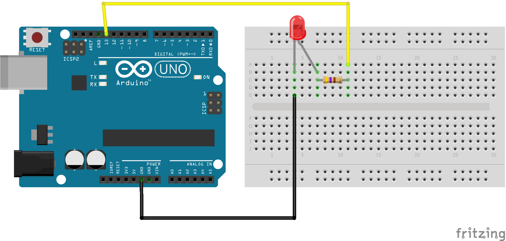

# Using an LED

This basic project will introduce the beginner Arduino user to simple code & circuits by turning on & off an LED.



## Required Kit Components
| Part          | Quantity  	|
| ------------- |:-------------:|
| LED		| 1 		|
| Resistor	| 1		|
| Jumper Wires	| 2     	|

## Code
```cpp
void setup()					// Runs once when sketch starts

{
  pinMode(13, OUTPUT);				// Setting the LED pin as an output
}

void loop()					// Runs repeatedly
{
  digitalWrite(13, HIGH);			// Turning the LED on
  delay(1000);              			// Waiting 1 second
  digitalWrite(13, LOW);    			// Turning the LED off
  delay(1000);             			// Waiting 1 second
}
```
