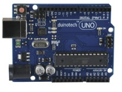
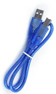
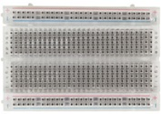
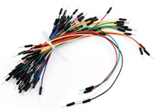
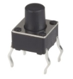
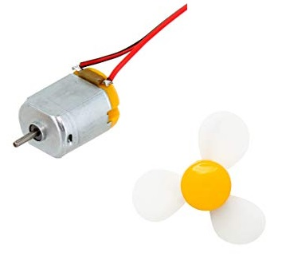
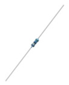
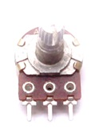
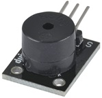
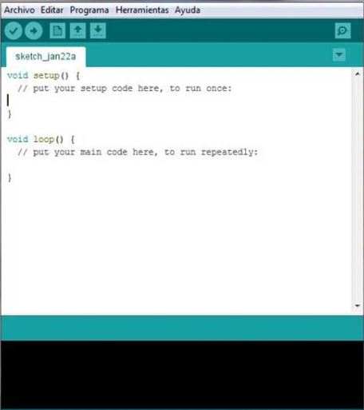

# Arduino Starter Kit

This entry level kit contains the basics you'll need to get started in the world of Arduino & features projects that set the foundations for putting your own ideas into action.

## What is Arduino
Arduino refers to an open-source electronics platform or board and the software used to program it. Arduino is designed to make electronics more accessible to artists, designers, hobbyists and ayone interested in creating interactive objects or environments.

## What's Included

| Part          | Image | Description  		|
| ------------- | ------------- |---------------------|
|  | Uno Board | The duinotech Uno is an open source single-board controller capable of controlling multiple input and output devices. |
|  | USB Cable | You'll need this to connect your Uno to your computer to power and load code onto the board. |
|  | Breadboard | Breadboards are handy boards used for testing circuit designs. With multiple pins you can easily connect multiple sensors, switches and LEDs. |
|  | Jumper Leads | Jumper wires are wires that have connector pins at either end, and are commonly used between the Uno, breadboard & and any external sensors you might be using in your next project. |
|  | LEDs | LED stands for 'Light Emitting Diode', a semiconductor device that converts electricity into light. In simple terms, it's a small light that operates on a low voltage. |
|  | Tactile Switches | These switches can be used to turn on and off circuits. They are momentary, meaning they only operate when the button is held down. |
|  | DC Motor with Fan | DC motor is one type of motor that uses the DC current to convert electrical energy into mechanical energy. This small motor & fan combination is used in project 4 to control the speed of the fan. |
|  | Resistors | A resistor is an electrical component that limits or regulates the flow of electrical current in an electronic circuit. |
|  | Potentiometer | A potentiometer is a three-terminal resistor with a sliding or rotating contact that forms an adjustable voltage divider. Where only two pins are used, it becomes a variable resistor. |
|  | Buzzer | A buzzer is an electrical device that makes a buzzing noise and is used for signaling. |

## Getting Started

### Install Arduino IDE
The Arduino IDE can be found on the official Arduino website at https://www.arduino.cc/en/Main/Software

Download the version suitable for your computer and follow the prompts to install the software package.

### Write or Paste Code 
Opening the Arduino IDE for the first time, you will be presented with the following screen.

This is where you will write or paste in the code for your project.

### Uploading Code
Now that you have prepared your code, it's time to upload it onto the board.

#### Selecting Board type & Port
You'll need to select the entry in the Tools > Board menu that corresponds to your Arduino board. For the duinotech Uno, you will select Arduino/Genuino Uno.

Select the serial device of the board from the Tools | Serial Port menu. This is likely to be COM3 or higher (COM1 and COM2 are usually reserved for hardware serial ports). To find out, you can disconnect your board and re-open the menu; the entry that disappears should be the duinotech Uno board. Reconnect the board and select that serial port.

#### Uploading Code
Now, simply click the "Upload" button in the environment. Wait a few seconds - you should see the RX and TX LEDs on the board flashing. If the upload is successful, the message "Done uploading." will appear in the status bar. 

The example projects in this kit are free of errors, however, if you write your own code you may find an error when uploading your code. The software will show a message indicating the type of error and the location in which it appears in the code.

## Projects
Now that you have the Arduino IDE setup and ready to use you can begin working through our beginner projects.

| Project          | Outcome |
| ------------- |:---------------------:|
| [Using an LED](https://github.com/Jaycar-Electronics/Arduino-Starter-Kit/tree/master/Using%20An%20LED) | This basic project will introduce the beginner Arduino user to simple code & circuits by turning on & off an LED. |
| [Using a Potentiometer](https://github.com/Jaycar-Electronics/Arduino-Starter-Kit/tree/master/Using%20A%20Potentiometer) | Use a potentiometer to adjust the brightness of the in-built LED on the Arduino Uno. |
| [Using Buttons](https://github.com/Jaycar-Electronics/Arduino-Starter-Kit/tree/master/Using%20Buttons) | Use feedback from an analogue sensor to activate a buzzer via the Arduino board. |
| [Fan Speed Controller](https://github.com/Jaycar-Electronics/Arduino-Starter-Kit/tree/master/Fan%20Speed%20Controller) | Use variable feedback from a potentiometer to adjust the speed of the motor. |
| [Traffic Lights](https://github.com/Jaycar-Electronics/Arduino-Starter-Kit/tree/master/Traffic%20Lights) | Simulate traffic lights using multiple LEDs & a loop circuit in Arduino. |